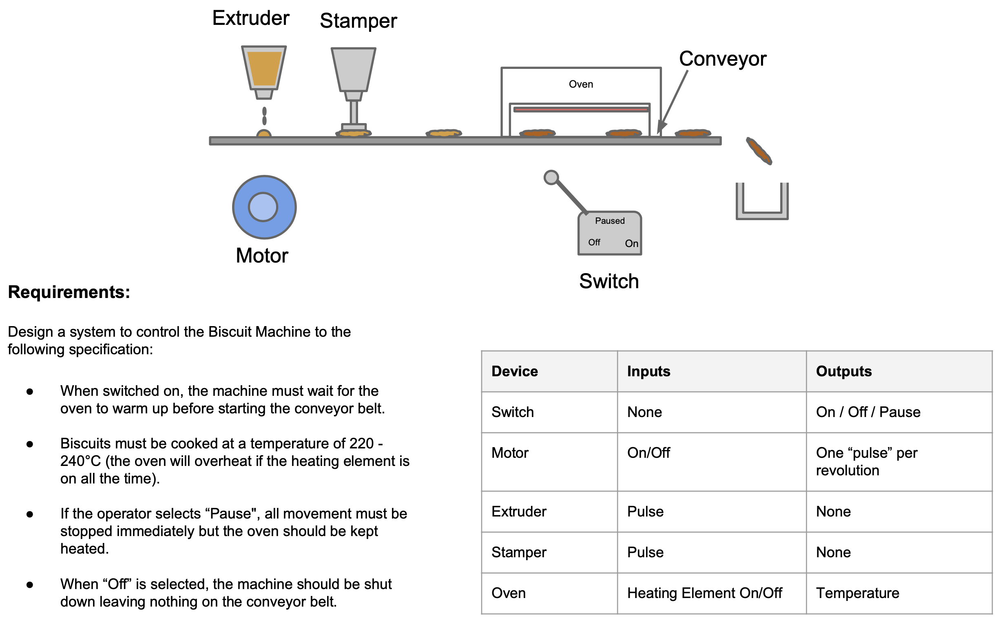

# The Biscuit Machine :cookie:



## Getting started

### Docker

To run the project locally you will need to install Docker first. You can get Docker Desktop for Linux, Mac and Windows [here](https://www.docker.com/products/docker-desktop).

Finaly, build the Docker image by typing: `docker build -t biscuit-machine .` in your Terminal.

#### Terminal

To start the project inside a terminal of your choice run `docker run -it --rm biscuit-machine`.


### Without using Docker

To run the project locally you will need to install Node.js first on your computer. You can get Node.js for Linux, Mac and Windows [here](https://nodejs.org/en/download/).

#### Terminal

To start the project inside a terminal of your choice run `node index.js`.


## Running the Biscuit Machine

After the project is succesfully set up and started, you should be seeing:
```
>
```
in your Terminal.

For instance, you should be seeing something like:


Operations:
- to start the machine, type: `bm.on()`;
- to pause the machine, type: `bm.pause()`;
- to stop the machine, type: `bm.off()`;
- to exit the machine panel, type `.exit` or double-press `ctrl + C`.


## Running the Biscuit Machine's tests

First, you should install the `jest` testing framework as typing in your terminal `npm install` in the root directory of the project.

To run the tests type the `npm test` command in your terminal.


You should be also seeing some `console.log`(s) which are from the machine in order to have some "feedback" from the machine.


_Disclaimer: The project is still under construction, so some changes will be introduced in the near future._
